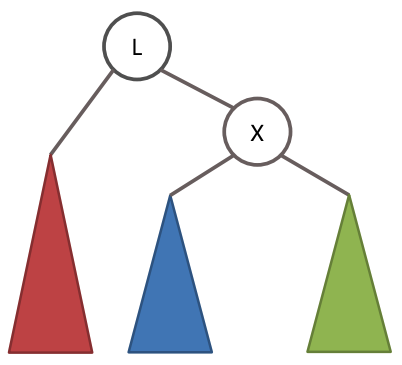

# 자료구조 강의 실습

## 자료구조 주제 목록

1. [연결리스트, 양방향 연결리스트](#연결리스트)
2. 스택, 큐
3. [선택정렬, 삽입정렬](#선택정렬)
4. 퀵정렬
5. [계수정렬](#계수정렬)
6. 이진트리 & 이진트리의 구현및 순회
7. [우선순위큐](#우선순위큐)
8. 순차탐색과 이진탐색
9. [그래프의 개념과 구현](#그래프의-개념과-구현)
10. 깊이우선탐색
11. [너비우선탐색](#너비우선탐색)
12. 이진탐색트리
13. [AVL트리](#AVL트리)
14. 해시
15. 프림알고리즘
16. 다익스트라의 최단경로
17. 세그먼트트리
18. 인덱스트리
19. KMP 문자열매칭
20. 라빈카프 문자열 매칭

## 주제별 간단 정리

### 연결리스트
* 데이터와 다음노드를 가리키는 부분이 있는 리스트
* 장점
    * 배열에 비해 원소의 삽입과 삭제가 간단
* 단점
    * 특정 인덱스로 즉시 접근하지 못하고 앞에서부터 차례대로 검색해야 함
    * 추가적인 포인터 변수가 사용되므로 메모리 공간 낭비

### 양방향 연결 리스트
* Head와 Tail을 가지고 있어 앞노드와 뒤 노드의 정보를 모두 저장
* 데이터를 앞에서부터, 뒤에서부터 모두 저장할 수 있음

### 선택정렬
* 가장 작은 것을 선택해서 앞으로 보내는 정렬 기법
* O(N^2)의 시간 복잡도를 가짐
    * 가장 작은 것을 선택하는 데에 N번
    * 앞으로 보내는 데에 N번

### 삽입정렬
* 선택한 숫자를 적절한 위치에 삽입

### 계수정렬
* 계수정렬(Counting Sort)은 각 인덱스가 몇개인지 세고, 작은 인덱스부터 해당 개수대로 정렬시키는 방법

    * `32010322`가 있을 때 각 인덱스와 원소는 아래와 같다. (0이 2개 1이 1개 2가 3개 3이 2개 이런식)   
    
    | 인덱스 | 0 | 1 | 2 | 3 |
    |:------:|:-:|:-:|:-:|:-:|
    |  원소  | 2 | 1 | 3 | 2 |

    정렬은 `00122233`로 이뤄진다. 

### 우선순위큐
* 우선순위를 가진 데이터를 저장하는 큐
* 데이터를 꺼낼 때 우선순위가 가장 높은 데이터가 가장 먼저 나온다.

### 그래프의 개념과 구현
* 그래프: 사물을 정점(Vertex)와 간선(Edge)으로 나타낸 도구
    * 간선은 각 정점으로 이동하는 비용을 나타낸다.
* 구현은 인접행렬, 인접리스트 두가지 방식으로 할 수 있다.
    * 인접행렬(Adjacency Matrix): 그래프를 2차원 배열로 표현한다. 
        * 각 정점의 값은 행과 열의 번호(=위치)가 된다.
        * 비용은 각 2차원 배열 셀의 값이 된다.
        * 연결되지 않은 정점끼리의 비용은 무한이다.
        * 장단점
            * 모든 정점의 연결 여부 저장 -> 공간효율성 떨어짐
            * 두 정점이 연결됐는지 확인은 빠르게 할 수 있음(O(1))
        * 예제
            * 
            * 위 그래프는 아래와 같이 표현할 수 있다. 
            
            * | | | |
                |-|-|-|
                | 0 | 3 | 7 |
                | 3 | 0 | 무한 |
                | 7 | 무한 | 0 |
    * 인접리스트(Adjacency List): 그래프를 연결리스트로 표현한다.
        * 각 정점에 가중치와 다음 연결 노드 정보를 저장해 표현할 수 있다.
        * 장단점
            * 연결된 간선의 정보만을 저장 -> 공간 효율성 우수
            * 두 정점이 연결됐는지 확인하기 위해 시간이 인접행렬에 비해 더 오래걸림(O(V))
    * 무방향 비가중치 그래프
        * 무방향 그래프: 모든 간선이 방향성을 가지지 않는 그래프
        * 비가중치 그래프: 모든 간선에 가중치(=비용)가 없는 그래프
        * 무방향 비가중치 그래프가 주어졌을 때 연결돼 있는 상황을 인접행렬로 출력할 수 있다.
            * 무방향이므로 연결된 정점끼리는 쌍방으로 표시
            * 비가중치이므로 연결됨을 표시하기 위해 모두 1을 표시해줌
    * 방향 가중치 그래프와 인접리스트
        * 방향 그래프: 모든 간선이 방향을 가지는 그래프
        * 가중치 그래프: 모든 간선에 가중치(=비용)가 있는 그래프
        * 무방향 비가중치 그래프가 주어졌을 때 연결된 상황을 인접리스트로 출력할 수 있다.
            * 각 정점에 가중치와 다음 연결 노드 정보를 저장
### 너비우선탐색
* 너비 우선 탐색(Breadth First Search)
    * 너비를 우선으로 탐색을 수행
    * 전체 노드 탐색 시 자주 사용
    * O(N)의 시간이 소요되는 전수 탐색 알고리즘
    * Queue 자료구조에 기초
* 탐색 방법
    1. 탐색시작 노드를 큐에 삽입하고 방문처리
    2. 해당 노드의 인접노드 중 방문하지 않은 노드들을 모두 큐에 삽입하고 방문처리
    3. 인접 노드가 모두 방문된 노드는 큐에서 꺼냄
    4. 2~3번 과정을 더 수행할 수 없을 때까지 반복
* 예제
    * 

### AVL트리
* AVL트리
    * 균형이 갖춰진 이진트리(Binary Tree) = 균형 인수가 +1, 0, -1인 트리
        * 균형인수 = | 왼쪽 자식 높이 - 오른쪽 자식 높이 |
        * AVL 트리의 각 노드는 균형인수를 계산하기 위해 자신의 높이(height) 값을 가짐
    * 균형이 흐트러진 경우 회전을 통해 완전 이진트리에 가까운 형태를 유지하게 한다.
        * 완전 이진트리는 검색에 있어 O(logN)의 시간 복잡도를 유지
        * 균형잡기는 각 노드가 삽입될때마다 수행
    
* 균형이 깨지는 경우
    * LL형식: 왼쪽자식의 왼쪽에 삽입
        * 
    * LR형식: 왼쪽자식의 오른쪽에 삽입
        * 
    * RR형식: 오른쪽자식의 오른쪽에 삽입
        * 
    * RL형식: 오른쪽자식의 왼쪽에 삽입
        * 
    
* 균형 바로잡기
    * LL 불균형 바로잡기
        * 
        * 
    * LR 불균형 바로잡기
        * 
        * 먼저 RR회전 실행
            * 
        * 그 다음에 LL회전 실행
            * 

