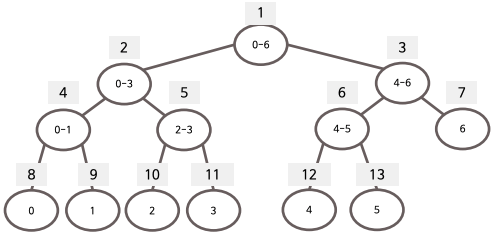

## 자료구조 주제 목록

1. [연결리스트, 양방향 연결리스트](#연결리스트)
2. [스택, 큐](#스택,-큐)
3. [선택정렬, 삽입정렬](#선택정렬)
4. [퀵정렬](#퀵정렬)
5. [계수정렬](#계수정렬)
6. [이진트리 & 이진트리의 구현및 순회](#이진트리-&-이진트리의-구현-및-순회)
7. [우선순위큐](#우선순위큐)
8. [순차탐색과 이진탐색](#순차탐색과-이진탐색)
9. [그래프의 개념과 구현](#그래프의-개념과-구현)
10. [깊이우선탐색](#깊이우선탐색)
11. [너비우선탐색](#너비우선탐색)
12. [이진탐색트리](#이진탐색트리)
13. [AVL트리](#AVL트리)
14. [해시](#해시)
15. [프림알고리즘](#프림알고리즘)
16. [다익스트라의 최단경로](#다익스트라의-최단경로)
17. [세그먼트트리](#세그먼트트리)
18. [인덱스트리](#인덱스트리)
19. [KMP 문자열 매칭](#KMP-문자열-매칭)
20. [라빈카프 문자열 매칭](#라빈카프-문자열-매칭)

## 주제별 간단 정리

### 연결리스트
* 데이터와 다음노드를 가리키는 부분이 있는 리스트
* 장점
    * 배열에 비해 원소의 삽입과 삭제가 간단
* 단점
    * 특정 인덱스로 즉시 접근하지 못하고 앞에서부터 차례대로 검색해야 함
    * 추가적인 포인터 변수가 사용되므로 메모리 공간 낭비

### 양방향 연결 리스트
* Head와 Tail을 가지고 있어 앞노드와 뒤 노드의 정보를 모두 저장
* 데이터를 앞에서부터, 뒤에서부터 모두 저장할 수 있음

### 스택, 큐
* 스택: 후입선출. 들어오고 나가는 곳이 한군데
* 큐: 선입선출. 들어오는 곳과 나가는 곳이 반대로 분리(push - pop)

### 선택정렬
* 가장 작은 것을 선택해서 앞으로 보내는 정렬 기법
* O(N^2)의 시간 복잡도를 가짐
    * 가장 작은 것을 선택하는 데에 N번
    * 앞으로 보내는 데에 N번
    
### 퀵정렬
* 분할정복이 핵심
    * 피벗값(하나 선택)을 중심으로 왼쪽에는 작은것들만 오른쪽에는 큰것들만 오도록 정렬
    * 피벗값 제외 왼쪽, 오른쪽 그룹 내에서 재귀적으로 반복

### 삽입정렬
* 선택한 숫자를 적절한 위치에 삽입

### 계수정렬
* 계수정렬(Counting Sort)은 각 인덱스가 몇개인지 세고, 작은 인덱스부터 해당 개수대로 정렬시키는 방법

    * `32010322`가 있을 때 각 인덱스와 원소는 아래와 같다. (0이 2개 1이 1개 2가 3개 3이 2개 이런식)   
    
    | 인덱스 | 0 | 1 | 2 | 3 |
    |:------:|:-:|:-:|:-:|:-:|
    |  원소  | 2 | 1 | 3 | 2 |

    정렬은 `00122233`로 이뤄진다. 

### 이진트리 & 이진트리의 구현 및 순회
* 자식노드가 최대 두개인 트리구조
* Full bt: 리프노드 제외 모든 노드가 두 자식
* Complete bt: 왼쪽부터 하나씩 채움
* Height Balanced Tree: 좌우 자식트리 높이가 2 이내

### 우선순위큐
* 우선순위 큐 Priority Queue
    * 우선순위를 가진 데이터를 저장하는 큐
    * 데이터를 꺼낼 때 우선순위가 가장 높은 데이터가 가장 먼저 나온다.
    * 선형적인 형태보다 트리 구조로 보는 것이 합리적. 일반적으로 최대 힙을 이용해 구현
    * 우선순위 큐의 삽입과 삭제는 O(logN)의 시간 복잡도를 가짐
    * 정렬도 O(logN)의 시간 복잡도를 가짐
* 최대힙 Max Heap
    * 부모노드가 자식노드보다 큰 값을 가진 이진 트리
    * 루트노드는 전체 트리에서 가장 큰 값을 가진다.
    * 삽입
        1. 삽입할 원소는 완전 이진트리를 유지하는 형태로 순차적으로 삽입(가장 마지막에 삽입)
        2. 루트노드까지 상향식으로 최대힙 구성
    * 삭제
        1. 루트노드를 삭제
        2. 가장 마지막 노드를 루트노드의 위치로 옮김
        3. 하향식으로 최대힙을 구성

### 순차탐색과 이진탐색
* 순차: 앞에서부터 하나씩 검사
* 이진: 분할 정복, 탐색범위를 반씩 좁혀가며 탐색. 정렬되어야 사용가능

### 그래프의 개념과 구현
* 그래프: 사물을 정점(Vertex)와 간선(Edge)으로 나타낸 도구
    * 간선은 각 정점으로 이동하는 비용을 나타낸다.
* 구현은 인접행렬, 인접리스트 두가지 방식으로 할 수 있다.
    * 인접행렬(Adjacency Matrix): 그래프를 2차원 배열로 표현한다. 
        * 각 정점의 값은 행과 열의 번호(=위치)가 된다.
        * 비용은 각 2차원 배열 셀의 값이 된다.
        * 연결되지 않은 정점끼리의 비용은 무한이다.
        * 장단점
            * 모든 정점의 연결 여부 저장 -> 공간효율성 떨어짐
            * 두 정점이 연결됐는지 확인은 빠르게 할 수 있음(O(1))
        * 예제
            * 
            * 위 그래프는 아래와 같이 표현할 수 있다. 
            
            * | | | |
                |-|-|-|
                | 0 | 3 | 7 |
                | 3 | 0 | 무한 |
                | 7 | 무한 | 0 |
    * 인접리스트(Adjacency List): 그래프를 연결리스트로 표현한다.
        * 각 정점에 가중치와 다음 연결 노드 정보를 저장해 표현할 수 있다.
        * 장단점
            * 연결된 간선의 정보만을 저장 -> 공간 효율성 우수
            * 두 정점이 연결됐는지 확인하기 위해 시간이 인접행렬에 비해 더 오래걸림(O(V))
    * 무방향 비가중치 그래프
        * 무방향 그래프: 모든 간선이 방향성을 가지지 않는 그래프
        * 비가중치 그래프: 모든 간선에 가중치(=비용)가 없는 그래프
        * 무방향 비가중치 그래프가 주어졌을 때 연결돼 있는 상황을 인접행렬로 출력할 수 있다.
            * 무방향이므로 연결된 정점끼리는 쌍방으로 표시
            * 비가중치이므로 연결됨을 표시하기 위해 모두 1을 표시해줌
    * 방향 가중치 그래프와 인접리스트
        * 방향 그래프: 모든 간선이 방향을 가지는 그래프
        * 가중치 그래프: 모든 간선에 가중치(=비용)가 있는 그래프
        * 무방향 비가중치 그래프가 주어졌을 때 연결된 상황을 인접리스트로 출력할 수 있다.
            * 각 정점에 가중치와 다음 연결 노드 정보를 저장

### 깊이우선탐색
* graph -  빠르게 모든 경우의 수를 탐색할 때, 스택구조를 이용해서 탐색
* 시작 노드 선택 
* 선택한 노드와 연결된 노드를 스택에 집어넣음 -> 반복
    * 이미 방문했던 노드는 바로 return 때려서 안가본데로 가도록 유도
* 인접노드 없는 경우 스택 최상단 노드(가장 최근에 들어간놈) 추출 
* 2-3번 반복

### 너비우선탐색
* 너비 우선 탐색(Breadth First Search)
    * 너비를 우선으로 탐색을 수행
    * 전체 노드 탐색 시 자주 사용
    * O(N)의 시간이 소요되는 전수 탐색 알고리즘
    * Queue 자료구조에 기초
* 탐색 방법
    1. 탐색시작 노드를 큐에 삽입하고 방문처리
    2. 해당 노드의 인접노드 중 방문하지 않은 노드들을 모두 큐에 삽입하고 방문처리
    3. 인접 노드가 모두 방문된 노드는 큐에서 꺼냄
    4. 2~3번 과정을 더 수행할 수 없을 때까지 반복
* 예제
    * 

###이진탐색트리
* 왼쪽노드 < 부모 노드 < 오른쪽노드 
    * insert/delete 할때 이진탐색이 항상 동작하도록 위치 지정

### AVL트리
* AVL트리
    * 균형이 갖춰진 이진트리(Binary Tree) = 균형 인수가 +1, 0, -1인 트리
        * 균형인수 = | 왼쪽 자식 높이 - 오른쪽 자식 높이 |
        * AVL 트리의 각 노드는 균형인수를 계산하기 위해 자신의 높이(height) 값을 가짐
    * 균형이 흐트러진 경우 회전을 통해 완전 이진트리에 가까운 형태를 유지하게 한다.
        * 완전 이진트리는 검색에 있어 O(logN)의 시간 복잡도를 유지
        * 균형잡기는 각 노드가 삽입될때마다 수행
    
* 균형이 깨지는 경우
    * LL형식: 왼쪽자식의 왼쪽에 삽입
        * 
    * LR형식: 왼쪽자식의 오른쪽에 삽입
        * 
    * RR형식: 오른쪽자식의 오른쪽에 삽입
        * 
    * RL형식: 오른쪽자식의 왼쪽에 삽입
        * 
    
* 균형 바로잡기
    * LL 불균형 바로잡기
        * 
        * 
    * LR 불균형 바로잡기
        * 
        * 먼저 RR회전 실행
            * 
        * 그 다음에 LL회전 실행
            * 

### 해시
* 최대한 빠른속도로 데이터를 관리하기 위해 사용. DB 등에 서 사용됨. 메모리 소모는 크다.
* 해시함수(input->fn->output) 인풋에 따라 항상 같은값이 나오는 함수 사용해서 나오는 값을 키(key)로 사용(나눗셈법이 가장 많이 사용됨)
* 키 중복(collision)을 방지하기 위함
    * probing(선형, 이차 조사법)
        * 동일키가 나오면 +1 위치에 저장(선형조사법)
        * 동일키가 나오면  +제곱수 위치에 저장(이차 조사법)
    * chaining 
        * 동일키가 나오면 연결리스트를 사용해서 키-값3-값2-값1 식으로 연결해서 저장(나중 들어온 것이 맨 앞으로) 
            
### 프림알고리즘
* 최소 신장 트리(Minimum Spanning Tree, MST)
    * 신장트리(Spanning Tree): 특정한 그래프에서 모든 정점을 포함한 그래프
    * 최소 신장 트리는 스패닝 트리 중에 간선의 가중치 합이 가장 작은 트리

* 일반적인 신장트리 Spanning tree의 그래프
    * 
* 최소 신장 트리 Minimum Spanning Tree 그래프
    * 

* 프림알고리즘(Prim's Algorithm)을 통해 최소신장트리를 구현한다.
    * 그래프 정점 하나를 선택
    * 해당 정점에서 연결된  간선 중에 가중치(=비용)가 가장 작은 간선을 찾음
    * 그 간선과 연결된 반대편 정점을 선택
    * 모든 정점이 선택될 때까지 위 과정을 반복한다.

* 간선에 대한 정보를 우선순위 큐에 담아 구현할 수 있다.
    * cost가 작은 노드를 우선으로 올리는 큐를 구현한다.

###다익스트라의 최단경로
* 프림알고리즘과 비슷하게, 그래프 각 변의 비용의 합이 최소가 되는 트리를 찾음
* 트리는 min heap(최소노드가 루트)
1. 그래프 시작점을 T 트리에 포함
2. T에 포함된 노드와 포함X 노드간 간선 중 비용이 최소인 간선 탐색
3. 포함되지 않은 노드를 T에 포함
4. 2-3 반복

### 세그먼트트리
* 자식노드의 값들을 합으로 가지는 트리
    * 
    * 트리 구조를 활용해 구간 합을 구하면 선형적으로 구간합을 구하는 것보다 효율적이다.
    * 트리 구조 중 하나의 값을 수정하고 싶다면, 해당 노드의 값이 포함된 상위노드를 모두 업데이트해줘야 한다.

### 인덱스트리
*  세그먼트트리와 비슷하게 **구간합**을 구하기 위한 방법, 세그먼트 트리보다 메모리 효율성이 좋다. 이미 구간합의 값을 가지고 있는 인덱스 
* 각 숫자의 **마지막비트값**을 구해야함 
    * a & -a (이진수)를 하면 마지막 비트값이 나온다함…
* 각 인덱스의 마지막 비트값 = 저장하고 있는 값의 개수
    * 1 -> 1개 저장, 2 -> (1-2)2개 저장, 3 -> 1개 저장, 4 -> (1-4) 4개저장, …
* 1부터 N까지의 구간합 
    * N부터 시작해서 마지막비트만큼 구간을 앞으로 이동하며 합을 구함
    * 13 (1개 저장) -> 12 (4개저장) -> 8 (8개저장)
    * 인덱스 트리를 수정할때는 해당 인덱스수정 + 마지막 비트만큼 뒤로 이동하며 수정해줘야함 (뒤에 인덱스가 해당 인덱스값도 포함하고 있으니까)

### KMP 문자열 매칭
* 단순 문자열 매칭
    * 자리를 한칸씩 옮기면서 문자열이 같은지 확인
* KMP 문자열 매칭
    * 접두사prefix와 접미사suffix를 이용해 빠르게 문자열 매칭을 수행하는 알고리즘
    * lps 배열을 이용한다.
    * 보통 찾는 문자열은 'pattern'으로 표현한다.
* lps 배열
    * pattern의 각 인덱스마다의 접두사와 접미사의 일치하는 개수를 표로 만든 것.
    * 예제: `abacdad`라는 문자열의 lps 배열
        * 
* lps 배열을 통해 pattern을 parent 문자열에서 찾아본다.
    * 비교하다가 불일치가 발생했을 때 단순 문자열 매칭처럼 한칸을 이동하는 것이 아니라 prefix와 일치하는 부분이 있는 곳으로 건너 뛰어서 이동
    * 예제
        * 
        
### 라빈 카프 문자열 매칭
* 특정 문자열에 대한 해시 값을 구함(연산 속도는 O(1)) -> 충돌 처리 필요
    * 각 문자의 아스키 코드 값에 2의 제곱 수를 차례대로 곱해서 더함
    * a * 2^6 + b * 2^5 + … + g * 2^0
    * 패턴을 문자열에서 찾기 위해서는 반복작업을 하는데, 문자열은 이어져있다는 특징을 사용해서 빠르게 계산 가능
        * 다음 해시값 = 2 * (현재 해시값 - 맨 앞 문자 값) + 새 문자 값
* 해시 값이 같은 경우(충돌날 수 있음)에만 문자열 재검사
    * 재검사? 실제 문자열 하나씩 비교해보는 것!