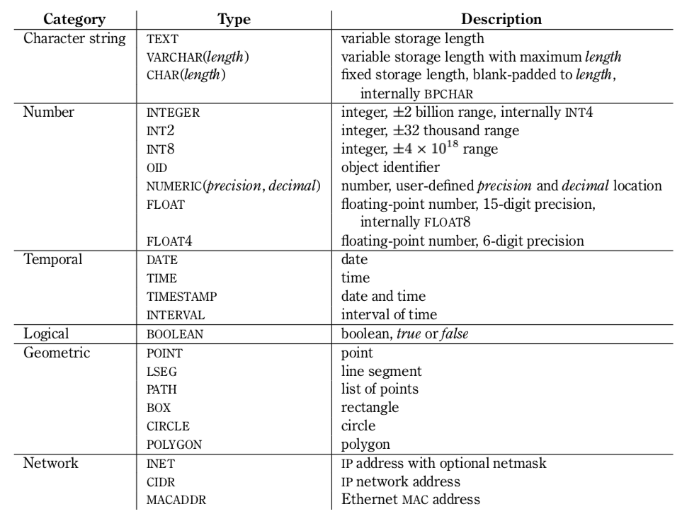
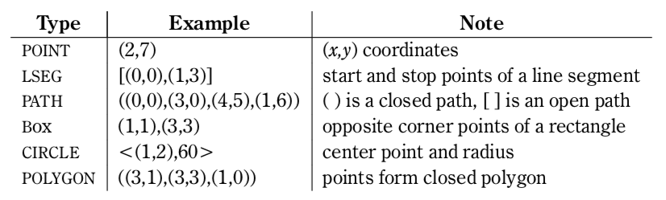

===========================
postgreSQL
===========================

.. Contents::

* postgreSQL를 설치하는 가장 간단한 방법은 `postgre.app`\ 을 설치하는 것.

Chapter 3 : Basic SQL Commands
========================================

3.1 Relational Databases
----------------------------------

SQL : Structured Query Language DB와 소통할 수 있는 가장 일반적인 방법이며 대부분의
DB 시스템에서 사용가능하다.

DB 안에는 Table이 있다.

- 참고 : `psql -l` : 현재 있는 DB리스트를 볼 수 있음.

- Table : RDBMS의 기초. 데이터를 가지고 있음.

  * row로 리스트 돼 있다.

  * column은 같은 타입의 정보를 담고 있다.

3.2 Creating Tables
----------------------------------

- `CREATE TABLE` : 테이블을 생성하는 쿼리

- `\\d` : 현재 접속한 데이터베이스의 테이블들을 보여줌. 특정 테이블의 정보를 보고 싶으면,
  뒤에 테이블 이름을 붙이면 됨.

3.3 Adding Data with INSERT
---------------------------------------

- `INSERT` 명령문 사용해서 데이터 입력

  예::

    insert into people values ('mark',25);

  - string 타입은 반드시 홑따옴표(\')를 써야함. 쌍따옴표(\")는 작동 안함.

  - string 상태로 따옴표 안에 들어가지 않는 한, 공백, 대문자는 안지켜도 됨.

3.4 Viewing Data with SELECT
-----------------------------------------

- `SELECT` 문으로만 데이터를 볼 수 있다.

  - `SELECT * FROM friend` : * 자리에 원하는 column명, friend에는 테이블명을 넣으면 됨.

3.5 Selecting Specific Rows with WHERE
------------------------------------------

- `SELECT`\ 와 함께, `WHERE`\ 를 사용하면 특정 조건에 맞는 row를 볼 수 있다.

  예::

    select * from people where age=25;

3.6 Removing Data with DELETE
------------------------------------

- `DELETE`\ 를 사용해 row를 지울 수 있다.

- `DELETE FROM friend WHERE age = 19;`

  - friend 테이블에서 나이가 19살인 row를 제거한다.

3.7 Modifying Data with UPDATE
---------------------------------------

`UPDATE`

- `UPDATE people SET age = 20 WHERE name = 'sue';`

  - name이 'sue'인 행의 age를 20로 변경(UPDATE)한다.

3.8 Sorting Data with ORDER BY
------------------------------------------

- `ORDER BY` : 원하는 순서로 정렬할 수 있다.

  - 'SELECT * FROM friend ORDER BY age DESC'

    - friend 테이블을 age에 대해 내림차순으로 정렬해서 보여준다.

  - `ASC` : 오름차순

  - `DESC` : 내림차순

3.9 Destroying Tables
--------------------------------------

- `DROP TABLE` : 테이블 삭제하기

  - 예: `DROP TABLE friend`

    - friend 테이블 삭제

3.10 Summary
----------------------------

- CREATE TABLE

- DROP TABLE

- SELET (& FROM, WHERE)

- INSERT

- UPDATE(& SET)

- DELETE

Chapter 4 : Customizing Queries
=======================================

4.1 Data Types
------------------------

  ============ =======================================
  category     Type
  ============ =======================================
  문자
               - CHAR(length)

               - VARCHAR(length)
  숫자
               - INTEGER

               - FLOAT

               - NUMERIC(precision, decimal)
  ============ =======================================

4.2 Quotes Inside Text
---------------------------------

- 문장 사이에 홑따옴표( ``'`` )를 넣고 싶으면, 홑따옴표를 두번 쓰면됨. 이렇게 "``''``"

- 혹은 앞에 백슬래시를 넣어라. 이렇게 "``\'``"

4.3 Using NULL Values
--------------------------------

- `NULL`

  - INSERT INTO friend VALUES ('jack', 'Burger', NULL);

    - NULL 이라고 쓰면 NULL 값이 들어간다.

- `IS NULL`, `IS NOT NULL` : NULL 값이 있는지 확인

- 빈 값인 ``''``\ 과 NULL 은 다르다.

4.4 Controlling DEFAULT Values
--------------------------------------

- 값을 넣지 않으면 나오는 디폴트 값을 제어할 수 있다.

- DEFAULT를 정의하지 않으면 NULL 값이 디폴트가 된다.

- 테이블을 정의할 때, DEFAULT로 값을 넣어주면된다.

  - 아래처럼 쓰면 time에 디폴트 값으로 CURRENT_TIMESTAMP 값이 들어가게 된다.

  ::

    CREATE TABLE account (
      name    CHAR(20),
      time    TIMESTAMP DEFAULT CURRENT_TIMESTAMP
    );

4.5 Column Labels
-----------------------------------

- `AS` : 컬럼에 라벨을 붙일 수 있다.

- `SELECT firstname AS buddy FROM friend;`

  - `firstname` 컬럼의 이름을 `buddy`\ 로 나타냄

4.6 Comments
-----------------------------------

- ``-- 내용`` : 한줄 comments에 사용

- ``/* 내용 */`` : 여러줄 comments에 사용

4.7 AND/OR Usage
---------------------------

- AND 예시 - firstname이 Sandy고, lastname이 Gleason인 row만 보기::

    SELECT * FROM friend
    WHERE firstname = 'Sandy' AND lastname='Gleason';

- OR 예시 - state가 NJ 거나, PA인 row 보기::

    SELECT * FROM friend
    WHERE state = 'NJ' OR state = 'PA';

- AND나 OR을 여러개 함께 쓸 때는 앞에 부터 적용된다.

  - 괄호로 지정해주면 괄호 안이 먼저 적용된다.

4.8 Range of VALUES
---------------------------------

- 사이의 값을 보고 싶으면 WHERE 절에 `BETWEEN 값1 AND 값2` 사용

4.9 LIKE Comparison
---------------------------------

- 문자열을 특정 패턴에 맞춰서 봐야할 때

- ``%``\ 나 ``_``\ 를 문자 그대로 쓰고 싶다면 앞에 백슬래시를 써줌.

- firstname이 D로 시작하는 row를 select::

    SELECT * FROM friend
    WHERE firstname like 'D%'

  ===================================== =========================
  Comparison                            Operation
  ===================================== =========================
  D로 시작                                LIKE 'D%'
  D를 포함                                LIKE '%D%'
  D가 두번째에 있음                         LIKE '_D%'
  D로 시작하고 e를 포함                      LIKE 'D%e%'
  D로 시작, e포함, 다음에 f포함               LIKE '_D%'
  D를 포함하지 않음                         NOT LIKE '_D%'
  ===================================== =========================

4.10 Regular Expressions
--------------------------------------------

- 정규표현식 사용 가능.

- 정규표현식의 자세한 내용은 따로 공부하는 것으로

4.11 CASE Clause
--------------------------------

age가 30 미만이면 ages에 20s라고 표시하고 아니면 30s라고 표시하기::

  SELECT name, age,
  CASE
    WHEN age < 30 then '20s'
    ELSE '30s'
  END
  AS ages
  FROM people;

4.12 Distinct Rows
------------------------------------

`DISTINCT` : 중복제거

- `select distinct age from people;`

  people의 age 컬럼에 있는 모든 값들에 대해 unique 값만 뽑아줌.

4.13 Functions and Operators
----------------------------------

- Functions 함수

  - 0개 이상의 인수를 받을 수 있고, 1개의 값을 반환한다.

  - `psql`\ 의 `\df` 명령어: 모든 함수의 리스트(반환값, 함수명, 인수)

  - `psql`\ 의 `\dd` 명령어: 함수의 이름, 설명

- Operators 연산자

  - 함수와 다른 점들이 있음

    - 이름이 아니라 symbol임

    - 보통 2개의 인수를 받음

    - 보통 인수는 연산자 양옆에 있음.

4.14 SET, SHOW, and RESET
--------------------------------------

- SET

- SHOW

- RESET

Chapter 5 : SQL Aggregates
=======================================

5.1 Aggregates
---------------------------

WHERE 절과 함께 사용

- COUNT, SUM, MAX, MIN, AVG

  * COUNT는 모든 행에서 사용가능, 나머지는 특정 컬럼에서 사용 가능

  * NULL 값은 무시되지만, 모든 값이 NULL이면 결과도 NULL로 나온다.
    (Count는 NULL 값도 무시하지 않고 계산한다.)

5.2 Using GROUP BY
------------------------------

friend 테이블에서 state 컬럼을 기준으로 그룹화하여 age에 대해 min, max, avg를 구한다::

  SELECT state, MIN(age), MAX(age), AVG(age)
  FROM friend
  GROUP BY state
  ORDER BY 4 desc;

5.3 Using HAVING
-------------------------

aggreate한 값에 대해서 조건을 걸어줌.

state 기준으로 count한 값에 대해서 1 초과인 것만 뽑음::

  SELECT state, COUNT(*)
  FROM friend
  GROUP BY state
  HAVING COUNT(*) > 1
  ORDER BY state;

5.4 Query Tips
-------------------------

- 하나의 쿼리에 여러 절을 사용할 때, 각 절을 다른 줄에 쓰는 것이 좋다.

- UPDATE, DELETE, INSERT와 같은 쿼리는 데이터베이스를 수정하기 때문에 조심해야한다.

  - 실행하기 전에 미리 같은 WHERE 절을 미리 SELECT에서 실행해서 확인해보는 것이 좋다.

Chapter 6 : Joining Tables
=======================================

여러 테이블에서 데이터 가져오기

- SELECT, FROM, WHERE을 이용해서 join한 테이블 가져오기

6.1 Table and Column References
-----------------------------------------

FROM 절에서 테이블 이름의 alias를 정할 수 있다.

friend 테이블의 alias를 f로 정함::

  SELECT f.firstname FROM friend f WHERE f.state = ’PA’;

6.2 Joined Tables
-------------------------

- 테이블을 여러개로 나누는 것의 장점

  - 수정이 용이

  - 데이터 찾기가 용이

  - 데이터가 한 곳에만 저장됨.

  - 저장 공간이 더 적게 필요함.

6.3 Creating Joined Tables
--------------------------------------

- 각 테이블의 primary key를 정해줌. 보통은 언더스코어(_)를 사용해서(예: `customer_id`)

- postgreSQL은 컬럼이나 테이블 이름 등의 모든 식별자를 소문자로 인식한다.

  - 굳이 대문자를 쓰고 싶으면 쌍따옴표(")로 감싸주면 된다. 하지만 항상 쌍따옴표를 써야하기 때문에 번거로워진다.

  - 식별자는 문자로 시작해야하고, 부호는 언더스코어(_)만 사용할 수 있다.

6.4 Performing Joins
--------------------------------------

- 아래 예는 `salesorder` 테이블의 `order_id` 컬럼을 가져온다.

- salesorder 테이블과 customer 테이블을 함께 사용했다.

- 조건 :

  - customer.name이 ’Fleer Gearworks, Inc.’

  - `alesorder.customer_id = customer.customer_id`

::

  SELECT salesorder.order_id
  FROM salesorder, customer
  WHERE customer.name = ’Fleer Gearworks, Inc.’ AND
        salesorder.customer_id = customer.customer_id;

- 위의 예에서 `customer_id`\ 는 `customer` 테이블과 `alesorder` 테이블 모두에 있어야 한다.

  - 그렇지 않으면, `ERROR: Column \'customer_id\' is ambiguous.` 에러가 나옴.

6.5 Three- and Four-Table Joins
------------------------------------------

3개 테이블의 컬럼을 참조하는데 AS절을 이용해서 컬럼 이름 명시::

  SELECT customer.name AS customer_name,
         employee.name AS employee_name,
         part.name AS part_name
  FROM   salesorder, customer, employee, part
  WHERE  salesorder.customer_id = customer.customer_id AND
         salesorder.employee_id = customer.employee_id AND
         salesorder.part_id = customer.part_id AND
         salesorder.order_id = 14673;

6.6 Additional Join Possibilities
------------------------------------------

6.7 Choosing a Join Key
-----------------------------------

- join key : 테이블 간에 행을 연결해주는 기준

- 문자보다 숫자를 join key로 사용하는 것이 좋은 이유

  - 숫자는 틀릴 위험이 적다.

  - 이름 같은 경우 동명이인이 있으면 join 할 때 구별할 수 없다.

  - (위에 이어서)고객 이름이 바뀌면, 이름을 참조한 모든 것들도 바꿔줘야 한다.

  - 숫자로 join 하는 것이 긴 문자에 대해 join 하는 것보다 훨씬 효율적이다.

  - 숫자가 문자보다 더 적은 용량을 차지한다.

- join key로는 아래 두가지를 사용하는 것이 좋다.

  - 숫자

  - 짧은 코드(문자, 숫자 포함): 특히 코드를 사용하는 것이 좋다.

    - 다만 아래의 경우에는 아닐 수도 있다.

      - 해당 코드의 사용주기가 짧을 때 (예)주문번호 등)

      - 쓸만한 적당한 코드를 만들 수 없을 때

      - 코드를 내부에서만 사용하고, 외부 사용자는 사용 안할 때

6.8 One-to-Many Joins
----------------------------------

- `one-to-one join` : 두 테이블 다 해당 행이 하나씩만 있는 경우

- `one-to-many join` : 한 테이블의 한 행이 다른 테이블에는 여러 행에 사용됨.

  - 예: 한 사용자가 여러 주문을 함.

- `one-to-none join` : 한 테이블에 있는 행이 다른 테이블에서는 안 쓰임.

  - 예: 사용자가 있는데, 주문한 것은 없음.

6.9 Unjoined Tables
---------------------------------

- Cartesian product : WHERE 절을 사용하지 않고 그냥 FROM 절에서 2개 테이블을 가져오면
  모든 행에 대해서 정보를 다 합치는 곱집합(Cartesian product)이 나온다.

  - 이걸 의도하는 경우는 거의 없다.

6.10 Table Aliases and Self-joins
------------------------------------------

`self-join` 사용 예(`customer`\ 를 `c`\ 와 `c2`\ 로 2번 사용)::

  SELECT c2.name
  FROM customer c, customer c2
  WHERE c.customer_id = 648 AND
        c.zipcode = c2.zipcode;

`customer_id`\ 가 648인 customer와 `zipcode`\ 가 같은 customer의 `name`\ 을 select

6.11 Non-equijoins
------------------------------------

- Equijoins : equality(=)를 이용한 가장 일반적인 join.

- non-equijoins : not equlal(<>)을 이용한 join

6.12 Ordering Multiple Parts
--------------------------------------

- 여러 개의 테이블에서 조건을 가져와서 join 할 수 있다.

6.13 Primary and Foreign Keys
--------------------------------------

- `primary key`: 각 테이블에서 join이 될 기준이 되는 고유한 컬럼(예: 고객 정보에서의 고객 아이디)

- `Foreign key`: 복사해올 때 기준이 되는 값(예: 주문서에서 고객 아이디)

Chapter 7 : Numbering Rows
=======================================

7.1 Object Identification Numbers (OIDs)
--------------------------------------------

- OID는 자동으로 부여된다.

- 데이터베이스가 생성, 삭제돼도 OID의 카운터는 계속 올라가기 때문에 중복이 생길 수 없다.

- 모든 postgreSQL는 OID 컬럼을 자동 생성한다.

- oid는 primary key나 Foreign key로 사용할 수 있다.

- 참고: 직접 실행해 본 바로는 oid도 생성되도록 따로 설정해줘야 하는 것 같다.

7.2 Object Identification Number Limitations
-------------------------------------------------------

OID의 3가지 제한 사항

- 연속적으로 번호가 매겨지지 않는다.

- 수정할 수 없다. INSERT 하면 생성되고, UPDATE로도 수정할 수 없다.

- 데이터베이스 백업 시 OID는 자동으로 백업되지 않는다. OID도 백업하려면 플래그를 추가해줘야 한다.

7.3 Sequences
---------------------------------

- `Sequence` : 사용자가 만든 카운터

- Sequence를 이용하면, INSERT에 대해서 고유한 숫자가 자동으로 부여된다.

- 함수

  - `nextval('name')`: 다음 사용 가능한 숫자를 반환하고, 카운터를 갱신한다.

  - `currval('name')`: 이전의 `nextval('name')` 함수의 이전 값을 반환한다. 증가시키진 않는다.

  - `setval('name', 'newval')`: 지정된 값에 다음 숫자 카운터를 세팅한다.

- `Sequence`\ 의 좋은 점은 숫자 할당 간의 갭을 없앨 수 있다는 것이다. (OID는 연속 값이 아닌 것과 비교해서)

  - 다른 테이블과 카운터를 공유하지 않기 때문에 갭이 없어진다.

- 한 테이블 안에서만 고유하다. 테이블마다 카운터가 있기 때문에, A테이블에서 16이 있으면 B테이블에도 16이 있을 수 있다.

7.4 Creating Sequences
---------------------------------

- Sequence는 OID처럼 자동으로 생성되지 않는다.

- `CREATE SEQUENCE 시퀀스이름` 사용

  - 직접 생성해보면, `Sequences`\ 에 생성되는 것을 볼 수 있다.

  - `nextval()`, `currval()`, `setval()`

예) 아래를 차례대로 실행하고 결과를 보자::

  CREATE SEQUENCE functest_seq;
  SELECT nextval(’functest_seq’); -- 결과: 1
  SELECT nextval(’functest_seq’); -- 결과: 2
  SELECT currval(’functest_seq’); -- 결과: 2
  SELECT setval(’functest_seq’, 100); -- 결과: 100
  SELECT nextval(’functest_seq’); -- 결과: 101

7.5 Using Sequences to Number Rows
------------------------------------------

- Sequence를 행 번호로 사용하는 방법

  1. Sequence를 생성한다.

  2. 테이블을 만들 때, 컬럼 디폴트로 `nextval()`\ 를 정의한다.

  3. INSERT 할 때, 해당 컬럼은 지정하지 않거나, `nextval()` 함수만 사용해서 지정한다.

  예::

    -- 시퀀스 생성
    CREATE SEQUENCE customer_seq;

    -- customer 테이블 생성
    CREATE TABLE customer (
                 customer_id INTEGER DEFAULT nextval('customer_seq'),
                 name VACH(30)
    );

    -- 값 INSERT
    INSERT INTO customer VALUES (nextval(’customer_seq’), ’Bread Makers’);
    INSERT INTO customer (name) VALUES (’Wax Carvers’);
    INSERT INTO customer (name) VALUES (’Pipe Fitters’);

7.6 Serial Column Type
-------------------------------------

- `SERIAL` 타입 컬럼 : Sequence가 자동으로 생성되고, 적절한 `DEFAULT`\ 가 설정된다.

7.7 Manually Numbering Rows
-------------------------------------

- 왜 수동으로 이런 숫자들을 부여하지 않는가?

  - Performance: 성능. 부여할 다음 값을 찾는 것이 오래걸릴 수 있음(수동이든 자동이든)

  - Concurrency: 중복 발생 위험.
    사용자들끼리 다음 값을 부여할 때 충돌이 일어날 수 있음.(동시에 같은 값을 사용-> 고유하지 X)

  - Standardization: 수동으로 부여하는 것보다 이런 방법을 쓰는게 더 안정적이고 확실하다.

Chapter 8 : Combining SELECTs
=======================================

8.1 UNION, EXCEPT and INTERSECT Clauses
---------------------------------------------

- `SELECT`\ 와 함께 사용할 수 있다.

  - 원래 2개 이상의 테이블에서 2개 이상의 SELECT를 하면 하나의 쿼리에 그걸 다 넣을 수 없는데,
    UNION 등의 절을 사용하면 여러 select를 하나의 쿼리에 넣을 수 있다.

  - 예를 들어, A테이블에서는 사과를 좋아하는 사람의 이름을 B테이블에서는 오렌지를 좋아하는 사람을 뽑는다.
    이때, A와 B 테이블은 전혀 다른 형식이라 join 할 수 없다고 가정한다.
    이런 경우에는 합집합을 이용해서 각각의 select 결과를 합해준다.

  - 단, 그 컬럼들의 형태는 같아야 한다. A테이블의 select 결과가 한 개의 이름 컬럼이면,
    B테이블에서도 한개의 이름 컬럼이 나와야 적용을 할 수 있다.
    B테이블에서는 이름 하나, 나이 하나 해서 총 2개의 컬럼이 나오면 안된다.

- 합집합 : `UNION`, `UNION ALL`

- 교집합 : `INTERSECT`, `INTERSECT ALL`

- 차집합 : `EXCEPT`, `EXCEPT ALL`

- `ALL`\ 이 붙어있으면 중복을 제거하지 않고 모두 보여줌. 즉, `ALL`\ 이 없으면 결과에서 중복을 제거하고 보여준다.

`UNION ALL`\ 의 예::

  SELECT name
  FROM aquatic_animal
  UNION ALL
  SELECT name
  FROM terrestrial_animal;

- 교집합, 차집합도 모두 비슷하게 사용한다.

8.2 Subqueries
-----------------------------

- 서브쿼리는 SELECT를 연속으로 사용하는 것(chaining)과 비슷하다.

- SELECT chaining은 쿼리를 같은 레벨로 결합하지만, 서브쿼리는 SELECT가 그 안에 쿼리를 갖게 한다.

- 여러 함수의 역할을 할 수 있다.

  - They can take the place of a constant.

  - They can take the place of a constant yet vary based on the row being processed.

  - They can return a list of values for use in a comparison.

Subqueries as Constants
^^^^^^^^^^^^^^^^^^^^^^^^^^^^^

- 서브쿼리(혹은 subselect라고도 부름)는 쿼리에서 상수(constant)를 대체할 수 있다.

  - 단, 상수는 변하지 않지만, 서브쿼리는 쿼리가 실행될 때마다 계산된다.

  예(위의 쿼리를 서브쿼리를 이용해서 아래처럼 표현)::

    SELECT f1.firstname, f1.lastname, f1.state
    FROM   friend f1, friend f2
    WHERE  f1.state <> f2.state And
           f2.firstname = ’Dick’ AND
           f2.lastname = ’Gleason’
    ORDER BY firstname, lastname;

    -- 서브쿼리 사용
    SELECT f1.firstname, f1.lastname, f1.state
    FROM friend f1
    WHERE f1.state <> (
                       SELECT f2.state
                       FROM friend f2
                       WHERE f2.firstname = ’Dick’ AND
                             f2.lastname = ’Gleason’
                      )
    ORDER BY firstname, lastname;

Subqueries as Correlated Values
^^^^^^^^^^^^^^^^^^^^^^^^^^^^^^^^^^^^

- Correlated Value: 계산되고 있는 행에 따라 달라진다. 모든 행에 대해 반복적으로 계산된다.

  - 보통 서브쿼리는 한번만 실행되고, 그 결과가 메인쿼리에서 사용된다.

  예::

    SELECT f1.firstname, f1.lastname, f1.age
    FROM friend f1, friend f2
    WHERE f1.state = f2.state
    GROUP BY f2.state, f1.firstname, f1.lastname, f1.age  HAVING f1.age = max(f2.age)
    ORDER BY firstname, lastname;

    -- 서브쿼리 사용
    SELECT f1.firstname, f1.lastname, f1.age
    FROM friend f1
    WHERE age = (
                  SELECT MAX(f2.age)
                  FROM friend f2
                  WHERE f1.state = f2.state -- 서브쿼리 밖에 있는 f1을 이용
                )

Subqueries as Lists of Values
^^^^^^^^^^^^^^^^^^^^^^^^^^^^^^^^^^^^^^

- 서브쿼리가 하나의 값이 아닌 여러 값의 리스트를 반환할 수 있음.

  salesorder 테이블의 order_date가 ’7/19/1994’인
  employee_id를 찾아 employee.name을 반환하는 예::

    -- join 사용
    SELECT DISTINCT employee.name
    FROM employee, salesorder
    WHERE employee.employee_id = salesorder.employee_id AND
          salesorder.order_date = ’7/19/1994’;

    -- 서브쿼리 사용
    SELECT name
    FROM employee
    WHERE employee_id IN (
                          SELECT employee_id
                          FROM salesorder
                          WHERE order_date = '7/19/1994'
                          );

  아래 예는 서브쿼리에서 해당 조건을 만족하는 employee_id의 리스트를 반환하고,
  그 리스트에 있는 employee_id에 대한 employee 테이블의 name을 select 한다.

NOT IN and Subqueries with NULL Values
^^^^^^^^^^^^^^^^^^^^^^^^^^^^^^^^^^^^^^^^^^

`NOT IN` 서브쿼리가 NULL 값을 반환하면, `NOT IN` 비교는 항상 false를 반환한다.

  예::

    SELECT name
    FROM customer
    WHERE customer_id NOT IN (
                              SELECT customer_id
                              FROM salesorder
                              WHERE customer_id IS NOT NULL
                             );

  서브쿼리에 `WHERE customer_id IS NOT NULL`\ 를 추가해서
  서브쿼리의 결과에 NULL이 포함되는 것을 막을 수 있다.

Subqueries Returning Multiple Columns
^^^^^^^^^^^^^^^^^^^^^^^^^^^^^^^^^^^^^^^^^^

ANY, ALL, and EXISTS Clauses
^^^^^^^^^^^^^^^^^^^^^^^^^^^^^^^^^^^^^^^^^^

8.3 Outer Joins
-----------------------------

- `outer join` : 보통의 join과 비슷하지만, join이 안되는 행까지 포함된다.

  - 합집합과 같이 key 값에 없는 값도 포함해서 join한다.

  - 값이 없는 경우에는 NULL로 남겨둔다.

  UNION ALL을 이용해 Outer Join을 하는 예::

    SELECT name, order_id
    FROM customer, salesorder
    WHERE customer.customer_id = salesorder.customer_id
    UNION ALL
    SELECT name, NULL
    FROM customer
    WHERE customer.customer_id NOT IN (SELECT customer_id FROM salesorder)
    ORDER BY name;

8.4 Subqueries in Non-SELECT Queries
-------------------------------------------------

UPDATE와 DELETE 문에서 서브쿼리를 사용할 수도 있다.

8.5 UPDATE with FROM
-------------------------------------------------

- UPDATE를 사용할 때, 다른 테이블의 값을 쓰는 것도 가능하다.

  - 사용하려는 테이블을 FROM 절에 써주면 된다.

  예::

    UPDATE salesorder
    SET order_date = employee.hire_date
    FROM employee
    WHERE salesorder.employee_id = employee.employee_id AND
          salesorder.order_date < employee.hire_date;

  위에서 employee 테이블을 FROM 절에서 써줬기 때문에 SET, WHERE 절에서 사용할 수 있다.

8.6 Inserting Data Using SELECT
-------------------------------------------------

INSERT 문에서 SELECT 문 사용하기

예::

  INSERT INTO customer (name, city, state, country)
  SELECT lastname, city, state, ’USA’
  FROM friend

8.7 Creating Tables Using SELECT
-------------------------------------------------

`SELECT...INTO` 문으로 테이블을 만들 수 있다.

예::

  SELECT firstname, lastname, city, state
  INTO newfriend
  FROM friend;

- friend 테이블에서 firstname, lastname, city, state 컬럼을 가져와서 그 결과를 newfriend 테이블에 넣어줬다.

- AS 절을 사용하면 컬럼 이름도 변경할 수 있다.

Chapter 9 : Data Types
=======================================

9.1 Purpose of Data Types
-----------------------------------

- 데이터 타입을 사용하는 이유

  - 일관적인 결과

  - 데이터 유효성

  - 적은 저장공간

  - 좋은 성능

9.2 Installed Types
---------------------------

<postgreSQL에서 제공하는 데이터타입>

<Geometric types>

9.3 Type Conversion Using CAST
---------------------------------------

- 값을 INTEGER로 바꾸기: `CAST(val AS INTEGER)`

- 컬럼을 TEXT로 바꾸기: `CAST(date_col AS TEXT)`

9.4 Support Functions
----------------------------------

- postgreSQL는 많은 함수를 지원 한다.

  - 예) `upper()`: 모든 컬럼의 값을 대문자로 바꾸고 싶을 때 사용. 인수로 컬럼을 받는다.

- 함수 목록은 psql의 `\\df`\ 로 확인

9.5 Support Operators
----------------------------------

- 연산자는 함수와 비슷

- 연산자 목록은 psql의 `\\df`\ 로 확인

9.6 Support Variables
----------------------------------

<common variables>

9.7 Arrays
----------------------------------

postgreSQL는 배열(Array)도 지원한다. 모든 차원의 배열이 가능하다.

9.8 Large Objects (BLOBs)
----------------------------------

사진과 같이 크기가 큰 파일도 다룰 수 있다. 다만, 특정 데이터타입에 담는 것은 아니다.

-  `lo_import()`, `lo_export()` 함수를 이용한다.

Chapter 10 : Transactions and Locks
=======================================

10.1 Transactions
----------------------------------

- Transactions(트랜잭션) : 여러 행에 대해서 쿼리를 실행할 때, 한 행에라도 쿼리가 실행되지 않고 실행이 끝났다면 전체 행에도 모두 반영되지 않는다.

  - 즉, 모든 행에 쿼리가 제대로 실행되면, 비로소 데이터베이스에도 반영된다.

10.2 Multistatement Transactions
-------------------------------------

- 여러 명령문에 걸쳐서 Transaction을 지정할 수도 있다.

- 두 개 명령문이 하나만 실행되면 안되는 경우에(실행되려면 둘 다 되고, 실패하려면 둘 다 실패해야 함.) 필요하다.

- 예::

    BEGIN WORK;
    쿼리
    COMMIT WORK;

10.3 Visibility of Committed Transactions
-----------------------------------------------

- Transaction이 완료(commit)되기 전까지는 다른 사용자에게 보이지 않는다!는 것이 또다른 장점.

- 완벽하게 실행되고, commit되기 전까지는 그것을 다른 사람들은 볼 수 없다.

10.4 Read Committed and Serializable Isolation Levels
-----------------------------------------------------

- 내 트랜잭션이 작동하고 있을때, 다른 트랜잭션의 행동을 볼 수 있다.

  - `READ COMMITTED` : 기본 레벨 Read-committed isolation level

  - `TRANSACTION ISOLATION LEVEL SERIALIZABLE` : Serializable isolation level

10.5 Locking
----------------

- `Exclusive locks`(혹은 `write locks`) : 사용자가 행이나 전체 테이블을 수정할 수 없게 하는 것.

  - 수정 중인 row는 동시에 수정할 수 없는 등의 제한

- isolation level로 조절할 수 있음.

- `LOCK`\ 을 통해서 수동으로 조절할 수도 있음(자세한 내용은 매뉴얼 참고)

10.6 Deadlocks
--------------------

- `Deadlock` 교착상태 : 풀 수 없는 잠금

  - 예: 2개의 트랜잭션이 서로 잠금을 걸고, 서로 잠금이 풀리기를 기다린다.
